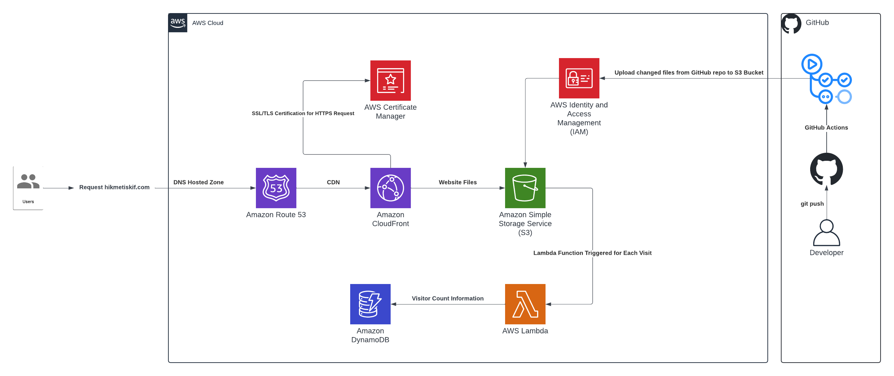

# AWS Cloud Resume Challenge
This is my attempt for AWS Cloud Resume Challenge. The website I built for this project is [hikmetiskif.com](https://hikmetiskif.com) .

## What is AWS Cloud Resume Challenge ?
AWS Cloud Resume Challenge is a hands-on project to use practical skills in cloud computing.   
The challenge involves creating a personal resume website using HTML, CSS, Javascript for frontend and Python for backend and hosting it on the AWS cloud, using various AWS services and best practices.   
The challenge also includes CI/CD using GitHub Actions, and Infrastructure as Code (IaC) using Terraform.

# Services Used
AWS services used in this challenge are:
- Amazon Route 53
- Amazon CloudFront
- Amazon Simple Storage Service (S3)
- AWS Certificate Manager
- AWS Lambda
- Amazon DynamoDB
- AWS Identity and Access Management (IAM)

# Architecture
The architecture of the project can be seen on image below:

  
